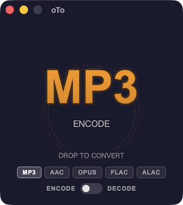
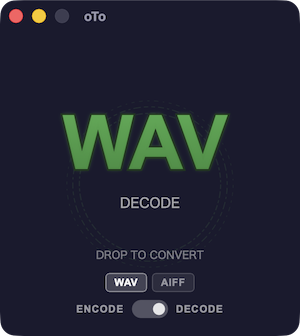
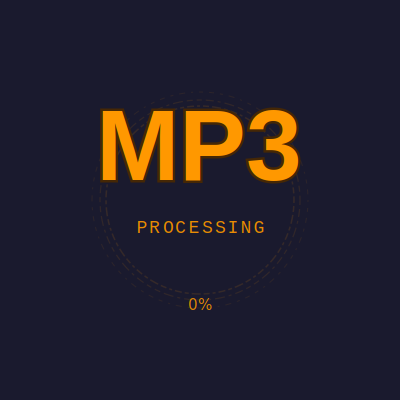

# oTo — Audio Converter

[](LICENSE)

macOS / Windows 向けのシンプルで高速なオーディオ変換アプリ。FFmpeg をサブプロセスとして呼び出し、ドラッグ＆ドロップによりファイルを選択して、mp3, aac, opus, flac, alac へのオーディオフォーマットへの変換を行います。

## アプリ名の由来
**oTo**（オト）は、日本語の「**音**」という言葉の響きと、データの変換（mp3 **to** wav 等）や橋渡しを意味する「**to**」を組み合わせた名前です。

## スクリーンショット





## 背景アニメーション

アプリケーションの3つの状態ごとに異なるSVGアニメーションが用意されています。

| スタンドバイ | ホバー | 処理中 |
|:---|:---|:---|
| [](src/svgs/background_standby.svg) | [](src/svgs/background_hover.svg) | [](src/svgs/background_processing.svg) |


## 主な機能

- **豊富な対応フォーマット** — 音声データ（wav, mp3, m4a, flac, ogg, opus, wma, aiff, aif, alac等）, 映像データ（mp4, mov, mkv, m4v, avi等） FFmpeg依存。
- **エンコード / デコード** — mp3, aac, opus, flac, alac / wav, aiff
- **ドラッグ＆ドロップ変換** — ファイルをアプリウィンドウにドラッグ＆ドロップするだけで即座に変換開始
- **ジョブの一時停止・再開・キャンセル** — ESCキーで一時停止 → ダイアログから「続ける」「中止する」を選択
- **設定ウィンドウ** — 出力先フォルダ、同名ファイルの競合処理、ビットレート/圧縮レベル、変換後ファイルの扱い（保持/削除）、言語などをカスタマイズ可能
- **日英i18n対応** — システム言語自動検出を含む多言語UI
- **軽量デザイン** — Tauri 2ベース（Rustバックエンド + バニラJSフロントエンド）

## 技術スタック

| レイヤー | 技術 |
| --- | --- |
| フレームワーク | [Tauri 2](https://tauri.app/) (macOS / Windows) |
| バックエンド | Rust (tokio, walkdir, libc) |
| フロントエンド | Vanilla JS (ES modules), SVG-based UI |

## FFmpeg のインストール

oTo は FFmpeg サブプロセスを呼び出す形のため、FFmpeg 自体はバンドルされていません。使用前に別途インストールする必要があります。

- **macOS** — Homebrew を使用：
    ```bash
   brew install ffmpeg
    ```
   Homebrew がインストールされていない場合、[Homebrew公式サイト](https://brew.sh/index_ja) からインストーラーをダウンロードし、ターミナルで `brew` と入力してXcode Command Line Toolsのインストールを促されたらそれに従ってください。その後、再度上記コマンドを実行してください。
- **Windows** — winget または [公式ビルド](https://ffmpeg.org/download.html) から取得：
    ```bash
   winget install FFmpeg
    ```
   winget が使用できない場合は、[公式ビルド](https://ffmpeg.org/download.html) をダウンロードし、解凍後のフォルダに含まれる `bin` フォルダを環境変数 `PATH` に通してください。

未検出状態で oTo を起動すると、変換処理が失敗します。

## 開発環境セットアップ

```bash
# Tauri CLIのインストール（公式ガイド参照）
# https://tauri.app/start/

# プロジェクト依存関係のインストール
npm install

# 開発サーバー起動
npm run tauri dev
```

## ビルド

```bash
npm run tauri build
```

`src-tauri/target/release/` にアプリパッケージが生成されます。

## アーキテクチャ概要

```
src/                     # フロントエンド（HTML/CSS/JS）
├── index.html           # メインUI
├── main.js              # メインロジック（drag&drop, Tauriコマンド呼び出し）
├── svg-controller.js    # SVGアニメーションコントローラ
├── i18n/                # 国際化ファイル（ja, en）
├── settings/            # 設定ウィンドウ
├── about/               # バージョン情報ウィンドウ
└── assets/              # アイコン等

src-tauri/               # バックエンド（Rust）
├── src/
│    ├── main.rs          # エントリポイント
│    ├── lib.rs           # Tauraコマンド定義（変換・一時停止・再開・キャンセル）
│    ├── converter.rs     # FFmpeg連携、並列処理、プログレス通知
│    └── settings.rs      # 設定読み書き
└── Cargo.toml           # Rust依存関係
```

## ライセンス

[MIT License](LICENSE)

Copyright © 2026 Akito Matsuda
