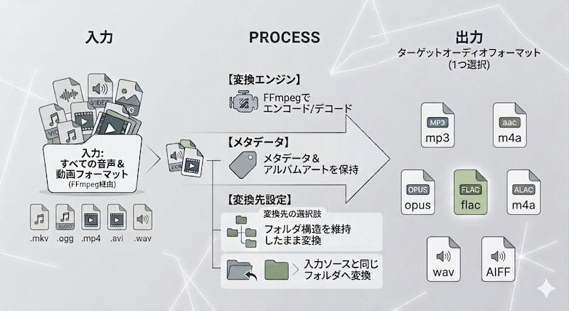
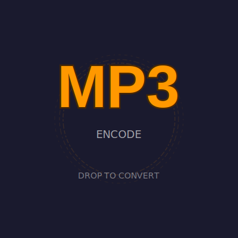
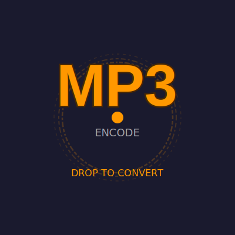
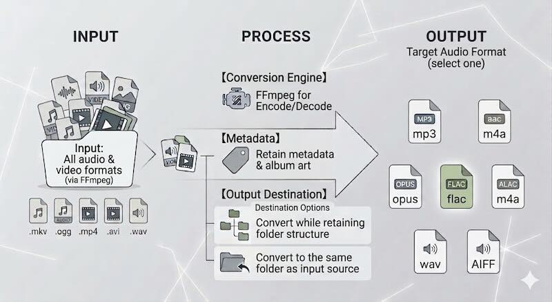

# oTo — Audio Converter

[](LICENSE)
[](#oto--audio-converter)
[](#english)

macOS / Windows 向けのシンプルで高速なオーディオ変換アプリ。FFmpeg をサブプロセスとして呼び出し、ドラッグ＆ドロップによりファイルを選択して、mp3, aac, opus, flac, alac へのオーディオフォーマットへの変換を行います。



## アプリ名の由来
**oTo**（オト）は、日本語の「**音**」という言葉の響きと、データの変換（mp3 **to** wav 等）や橋渡しを意味する「**to**」を組み合わせた名前です。

## スクリーンショット


## 背景アニメーション

アプリケーションの3つの状態ごとに異なるSVGアニメーションが用意されています。

| スタンドバイ | ホバー | 処理中 |
|:---|:---|:---|
| [](public/svgs/background_standby.svg) | [](public/svgs/background_hover.svg) | [](public/svgs/background_processing.svg) |


## 主な機能

- **豊富な対応フォーマット** — 音声データ（wav, mp3, m4a, flac, ogg, opus, wma, aiff, aif, alac等）、映像データ（mp4, mov, mkv, m4v, avi等）に対応。FFmpegに依存。
- **エンコード / デコード** — mp3, aac, opus, flac, alac / wav, aiff
- **ドラッグ＆ドロップ変換** — ファイルをアプリウィンドウにドラッグ＆ドロップするだけで即座に変換開始
- **無音トリミング** — 最初と最後の無音部分のトリミングが可能（デフォルト閾値 -80dB、調節可能）
- **ジョブの一時停止・再開・キャンセル** — ESCキーで一時停止 → ダイアログから「続ける」「中止する」を選択
- **設定ウィンドウ** — 出力先フォルダ、同名ファイルの競合処理、ビットレート/圧縮レベル、変換後ファイルの扱い（保持/削除）、言語などをカスタマイズ可能
- **日英i18n対応** — システム言語自動検出を含む多言語UI
- **軽量デザイン** — Tauri 2ベース（Rustバックエンド + バニラJSフロントエンド）

## 技術スタック

| レイヤー | 技術 |
| --- | --- |
| フレームワーク | [Tauri 2](https://tauri.app/) (macOS / Windows) |
| バックエンド | Rust (tokio, walkdir, libc) |
| フロントエンド | Vanilla JS (ES modules), SVG-based UI |
| ビルドツール | [Vite](https://vite.dev/) + [pnpm](https://pnpm.io/) |

## FFmpeg のインストール

oTo は FFmpeg サブプロセスを呼び出す形のため、FFmpeg 自体はバンドルされていません。使用前に別途インストールする必要があります。

- **macOS** — Homebrew を使用：
   ```bash
   brew install ffmpeg
   ```
  Homebrew がインストールされていない場合、[Homebrew公式サイト](https://brew.sh/index_ja) からインストーラーをダウンロードし、ターミナルで `brew` と入力してXcode Command Line Toolsのインストールを促されたらそれに従ってください。その後、再度上記コマンドを実行してください。

- **Windows** — winget または [公式ビルド](https://ffmpeg.org/download.html) から取得：
   ```bash
   winget install FFmpeg
   ```
  winget が使用できない場合は、[公式ビルド](https://ffmpeg.org/download.html) をダウンロードし、解凍後のフォルダに含まれる `bin` フォルダを環境変数 `PATH` に通してください。

未検出状態で oTo を起動すると、変換処理が失敗します。

## 開発環境セットアップ

```bash
# Tauri CLIのインストール（公式ガイド参照）
# https://tauri.app/start/

# pnpm のインストール（未インストールの場合）
npm install -g pnpm

# プロジェクト依存関係のインストール
pnpm install

# 開発サーバー起動（Vite + Tauri）
pnpm tauri dev
```

## ビルド

```bash
pnpm tauri build
```

`src-tauri/target/release/` にアプリパッケージが生成されます。

## アーキテクチャ概要

```
src/                       # フロントエンド（HTML/CSS/JS）
├── index.html             # メインUI
├── main.js                # メインロジック（drag&drop, Tauriコマンド呼び出し）
├── svg-controller.js      # SVGアニメーションコントローラ
├── style.css              # 共通スタイル
├── i18n/                  # 国際化ファイル（ja, en）
├── settings/              # 設定ウィンドウ
├── about/                 # バージョン情報ウィンドウ
├── svgs/                  # SVGアニメーション素材
└── assets/                # アイコン等

src-tauri/                 # バックエンド（Rust）
├── src/
│     ├── main.rs           # エントリポイント
│     ├── lib.rs             # Tauriコマンド定義（変換・一時停止・再開・キャンセル）
│     ├── converter/        # FFmpeg連携・変換処理モジュール
│     │     ├── mod.rs      # メイン変換ロジック・並列処理
│     │     ├── output.rs   # 出力パス解決・競合処理
│     │     ├── probe.rs    # ffprobe によるファイル解析
│     │     ├── silence.rs  # 無音トリミング処理
│     │     ├── codec_args.rs # コーデック引数生成
│     │     ├── file_collector.rs # ファイル収集
│     │     └── types.rs    # 型定義
│     └── settings.rs       # 設定読み書き
└── Cargo.toml             # Rust依存関係
```

## ライセンス

[MIT License](LICENSE)

Copyright © 2026 Akito Matsuda

### 依存ライブラリ

| パッケージ | バージョン | ライセンス |
| --- | --- | --- |
| @tauri-apps/api | ^2.0.0 | MIT |
| @tauri-apps/cli | ^2.0.0 | MIT |
| tauri | 2.11 | MIT |
| tauri-plugin-dialog | 2.7 | MIT |
| tokio | 1.52 | MIT |
| serde | 1.0 | MIT |
| serde_json | 1.0 | MIT |
| anyhow | 1.0 | MIT |
| walkdir | 2.5 | MIT |
| uuid | 1.23 (v4) | MIT |
| dirs | 6.0 | MIT |
| base64 | 0.22 | MIT |
| libc | 0.2 | MIT |
| windows-sys | 0.59 | MIT |
| FFmpeg | — | LGPL 2.1+ |

## English

### Application Name Origin
**oTo** (Oto) is a combination of the Japanese word "**音**" (sound) and "**to**", which represents both data conversion (mp3 **to** wav, etc.) and the idea of bridging or connecting.



### Screenshot


### Background Animation

Three different SVG animations are prepared for each state of the application.

| Standby | Hover | Processing |
|:---|:---|:---|
| [](public/svgs/background_standby.svg) | [](public/svgs/background_hover.svg) | [](public/svgs/background_processing.svg) |

### Main Features

- **Wide range of supported formats** — Supports audio data (wav, mp3, m4a, flac, ogg, opus, wma, aiff, aif, alac, etc.) and video data (mp4, mov, mkv, m4v, avi, etc.). Relies on FFmpeg.
- **Encode / Decode** — mp3, aac, opus, flac, alac / wav, aiff
- **Drag & Drop conversion** — Start conversion instantly by simply dragging and dropping files onto the app window
- **Silence trimming** — Trim leading and trailing silence (default threshold -80dB, adjustable)
- **Job pause/resume/cancel** — Pause with the ESC key → choose "Continue" or "Abandon" from the dialog
- **Settings window** — Customize output folder, conflict handling for same-named files, bitrate/compression level, post-conversion file handling (keep/delete), language, and more
- **Japanese/English i18n support** — Multilingual UI including automatic system language detection
- **Lightweight design** — Tauri 2-based (Rust backend + Vanilla JS frontend)

### Technology Stack

| Layer | Technology |
| --- | --- |
| Framework | [Tauri 2](https://tauri.app/) (macOS / Windows) |
| Backend | Rust (tokio, walkdir, libc) |
| Frontend | Vanilla JS (ES modules), SVG-based UI |
| Build Tools | [Vite](https://vite.dev/) + [pnpm](https://pnpm.io/) |

### Installing FFmpeg

oTo calls an FFmpeg subprocess, so FFmpeg itself is not bundled. It must be installed separately before use.

- **macOS** — Using Homebrew:
   ```bash
   brew install ffmpeg
   ```
  If Homebrew is not installed, download the installer from the [Homebrew official website](https://brew.sh) and follow the prompt in Terminal when prompted to install Xcode Command Line Tools by typing `brew`. Then run the above command again.

- **Windows** — Using winget or download from the [official build](https://ffmpeg.org/download.html):
   ```bash
   winget install FFmpeg
   ```
  If winget is unavailable, download the [official build](https://ffmpeg.org/download.html) and add the `bin` folder contained in the extracted directory to the `PATH` environment variable.

If oTo is launched while FFmpeg is not detected, conversion will fail.

### Development Environment Setup

```bash
# Install Tauri CLI (see official guide)
# https://tauri.app/start/

# Install pnpm (if not already installed)
npm install -g pnpm

# Install project dependencies
pnpm install

# Start development server (Vite + Tauri)
pnpm tauri dev
```

### Build

```bash
pnpm tauri build
```

The app package will be generated in `src-tauri/target/release/`.

### Architecture Overview

```
src/                        # Frontend (HTML/CSS/JS)
├── index.html              # Main UI
├── main.js                 # Main logic (drag&drop, Tauri command calls)
├── svg-controller.js       # SVG animation controller
├── style.css               # Shared styles
├── i18n/                   # Internationalization files (ja, en)
├── settings/               # Settings window
├── about/                  # About window
├── svgs/                   # SVG animation assets
└── assets/                 # Icons, etc.

src-tauri/                  # Backend (Rust)
├── src/
│    ├── main.rs             # Entry point
│    ├── lib.rs              # Tauri command definitions (convert, pause, resume, cancel)
│    ├── converter/          # FFmpeg integration & conversion module
│    │    ├── mod.rs         # Main conversion logic & parallel processing
│    │    ├── output.rs      # Output path resolution & conflict handling
│    │    ├── probe.rs       # File analysis via ffprobe
│    │    ├── silence.rs     # Silence trimming
│    │    ├── codec_args.rs  # Codec argument generation
│    │    ├── file_collector.rs # File collection
│    │    └── types.rs       # Type definitions
│    └── settings.rs         # Settings read/write
└── Cargo.toml              # Rust dependencies
```

### License

[MIT License](LICENSE)

Copyright © 2026 Akito Matsuda

#### Dependency Libraries

| Package | Version | License |
| --- | --- | --- |
| @tauri-apps/api | ^2.0.0 | MIT |
| @tauri-apps/cli | ^2.0.0 | MIT |
| tauri | 2.11 | MIT |
| tauri-plugin-dialog | 2.7 | MIT |
| tokio | 1.52 | MIT |
| serde | 1.0 | MIT |
| serde_json | 1.0 | MIT |
| anyhow | 1.0 | MIT |
| walkdir | 2.5 | MIT |
| uuid | 1.23 (v4) | MIT |
| dirs | 6.0 | MIT |
| base64 | 0.22 | MIT |
| libc | 0.2 | MIT |
| windows-sys | 0.59 | MIT |
| FFmpeg | — | LGPL 2.1+ |
