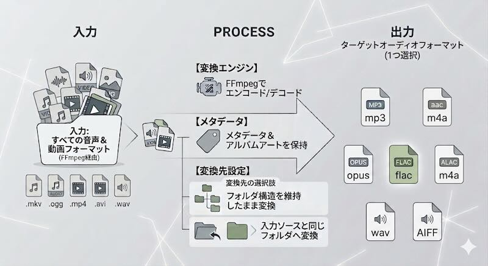
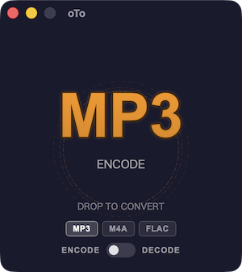
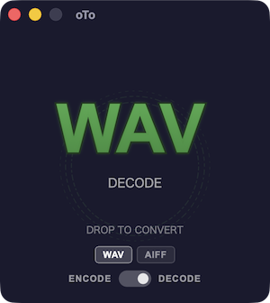
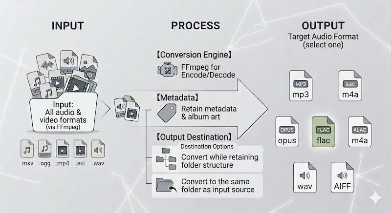

# oTo — Audio Converter

[](LICENSE)
[](#oto--audio-converter)
[](#english)

macOS / Windows向けのシンプルなオーディオ変換アプリです。ファイルをドラッグ＆ドロップして、音声・動画から必要な音声形式へ変換できます。



## 主な機能

- wav、mp3、m4a、flac、ogg、opus、wma、aiff、alacなどの音声ファイルに対応
- mp4、mov、mkv、m4v、aviなどの動画から音声を抽出
- mp3、aac、opus、flac、alacへのエンコードと、wav、aiffへのデコード
- ファイルやフォルダのドラッグ＆ドロップ変換
- ファイル先頭・末尾の無音トリミング
- 変換ジョブの一時停止、再開、キャンセル
- 出力先、同名ファイルの処理、音質、変換後の元ファイル処理を設定可能
- 日本語・英語UI

## ダウンロード

最新版は[GitHub Releases](https://github.com/NJ1216/oTo/releases/latest)からダウンロードできます。

Windowsで初回起動時に警告が表示される場合は、配布元がこのリポジトリであることを確認してから実行してください。

## FFmpegの準備

oToの使用にはFFmpegが必要です。FFmpegはアプリに同梱されていないため、先にインストールしてください。

### macOS

[Homebrew](https://brew.sh/index_ja)をインストール後、ターミナルで次を実行します。

```bash
brew install ffmpeg
```

### Windows

ターミナルで次を実行します。

```powershell
winget install FFmpeg
```

wingetを利用できない場合は、[FFmpeg公式ダウンロードページ](https://ffmpeg.org/download.html)から取得し、展開先の `bin` フォルダを環境変数 `PATH` に追加してください。

## 使い方

1. oToを起動します。
2. ENCODEまたはDECODEを選び、出力形式を指定します。
3. ファイルまたはフォルダをウィンドウへドラッグ＆ドロップします。
4. 変換が完了するまで待ちます。

設定画面では、出力先、音質、無音トリミング、同名ファイルが存在する場合の処理などを変更できます。変換中にEscキーを押すと、処理を一時停止または中止できます。

## スクリーンショット




## ライセンス

[MIT License](LICENSE)

Copyright © 2026 NJ

第三者ライセンス通知は、アプリ内の「バージョン情報」から確認できます。

## English

oTo is a simple audio converter for macOS and Windows. Drag and drop files or folders to convert audio and extract audio tracks from video files.



### Features

- Supports common audio formats including wav, mp3, m4a, flac, ogg, opus, wma, aiff, and alac
- Extracts audio from mp4, mov, mkv, m4v, avi, and other video formats
- Encodes to mp3, aac, opus, flac, and alac; decodes to wav and aiff
- Drag-and-drop conversion of files and folders
- Optional trimming of leading and trailing silence
- Pause, resume, and cancel conversion jobs
- Configurable output folder, quality, file-conflict behavior, and source-file handling
- Japanese and English interface

### Download

Download the latest version from [GitHub Releases](https://github.com/NJ1216/oTo/releases/latest).

On Windows, an initial launch warning may appear. Confirm that the application came from this repository before running it.

### Install FFmpeg

oTo requires FFmpeg, which is not bundled with the application.

On macOS with [Homebrew](https://brew.sh):

```bash
brew install ffmpeg
```

On Windows:

```powershell
winget install FFmpeg
```

If winget is unavailable, download FFmpeg from the [official download page](https://ffmpeg.org/download.html) and add its `bin` directory to `PATH`.

### Usage

1. Launch oTo.
2. Select ENCODE or DECODE and choose an output format.
3. Drag files or folders onto the window.
4. Wait for conversion to finish.

Use Settings to configure the output folder, quality, silence trimming, and file-conflict behavior. Press Esc during conversion to pause or cancel the job.

### License

[MIT License](LICENSE)

Copyright © 2026 NJ

Third-party license notices are available from the About window in the application.
